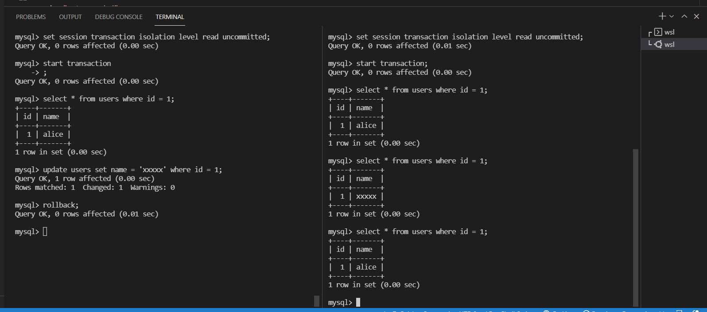
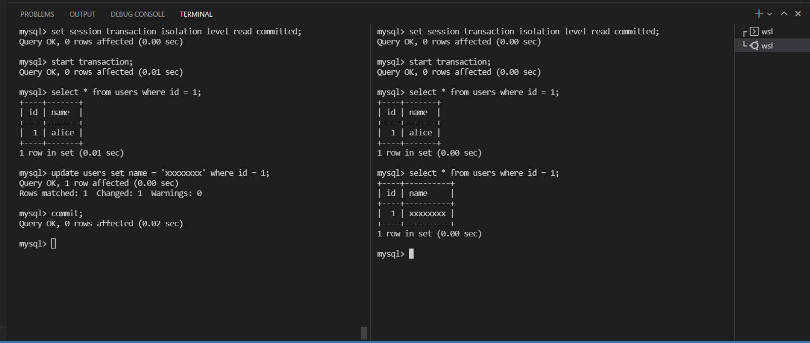
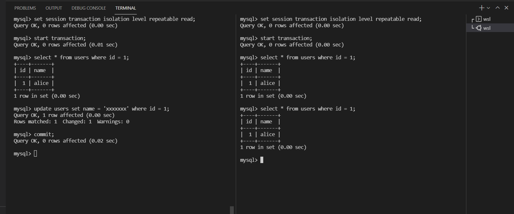
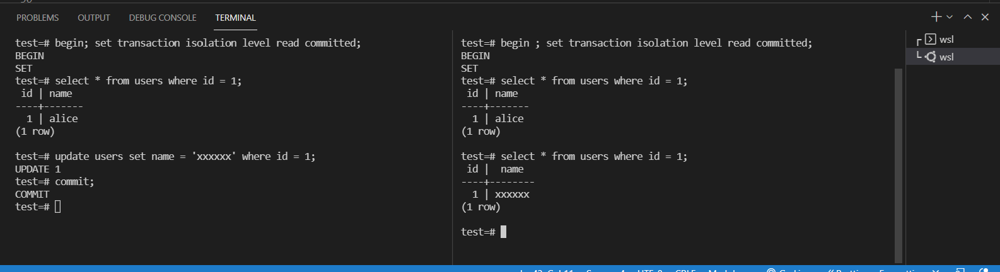
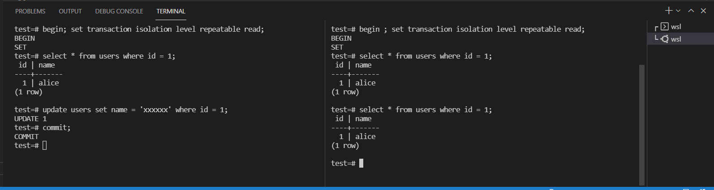
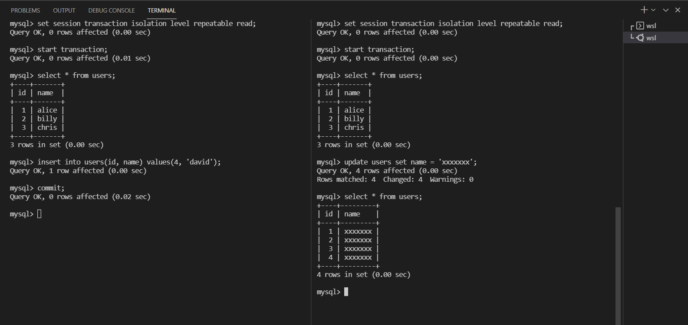

# highload-sw-arch-hw-09

# Prerequisites
* docker
* linux + bash

# 1. Run MySQL and PostgreSQL
```
./run.sh
```

# 2. Connect to MySQL and PostgreSQL and run queries

PostgreSQL

```
psql -h localhost -p 5432 -U root -W test
```

MySQL
```
mysql -h localhost -P 3306 --protocol=tcp -u root -p test --password=pass
```

In some cases, in PostgreSQL, dirty reads and phantom reads can't happen. More info here
https://www.postgresql.org/docs/9.5/transaction-iso.html

# 2. Run cleanup script

```
./cleanup.sh
```

# Dirty Reads, fixed with repeatable read level. NOTE : Can't happen in PostgreSQL

Percona



# Non-Repeatable Reads, fixed with repeatable read level

Percona



PostgreSQL



# Phantom Reads, fixed with serializable level, write transaction waiting for another write to be completed. NOTE : Can't happen in PostgreSQL

Percona

